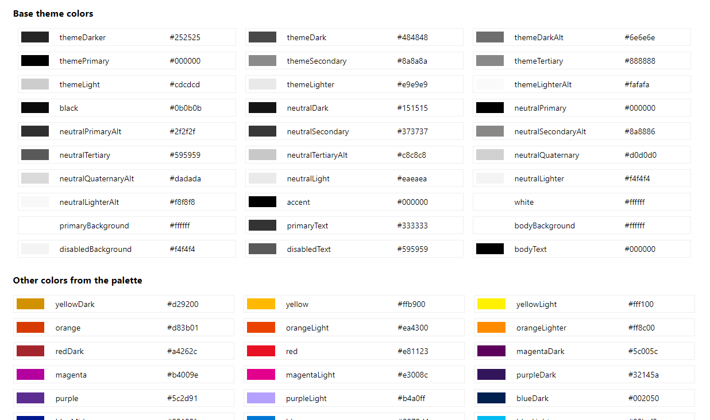

# Theme Colors Web Part

## Summary

This project is a SharePoint Framework web part that allows users to customize theme colors. It leverages modern web technologies to provide a seamless and interactive user experience.

## Used SharePoint Framework Version

## Applies to

- [SharePoint Framework](https://aka.ms/spfx)
- [Microsoft 365 tenant](https://docs.microsoft.com/en-us/sharepoint/dev/spfx/set-up-your-developer-tenant)

> Get your own free development tenant by subscribing to [Microsoft 365 developer program](http://aka.ms/o365devprogram)

## Prerequisites

- Node.js (v16.x or v18.x)
- npm (v8.x)
- A SharePoint Online tenant

## Solution

| Solution    | Author(s)                                               |
| ----------- | ------------------------------------------------------- |
| theme-colors-webpart | Glenn Reian (umeaworks.com) |

## Version history

| Version | Date             | Comments        |
| ------- | ---------------- | --------------- |
| 1.0     | September 13, 2024 | Initial release |

## Disclaimer

**THIS CODE IS PROVIDED _AS IS_ WITHOUT WARRANTY OF ANY KIND, EITHER EXPRESS OR IMPLIED, INCLUDING ANY IMPLIED WARRANTIES OF FITNESS FOR A PARTICULAR PURPOSE, MERCHANTABILITY, OR NON-INFRINGEMENT.**

---

## Minimal Path to Awesome

- Clone this repository
- Ensure that you are at the solution folder
- In the command-line run:
  - **npm install**
  - **gulp serve**

> Include any additional steps as needed.

## Features

- Customizable theme colors
- Real-time preview
- Easy integration with SharePoint Online